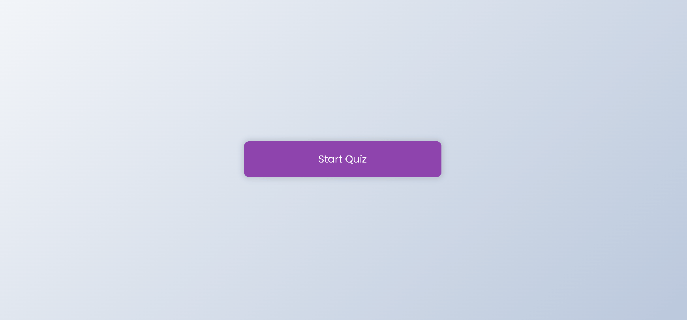

<div id="top"></div>


<h1 align="center">
    QUIZ
</h1>


## ABOUT THE PROJECT

<!-- ABOUT THE PROJECT -->
Welcome to the _GitHub repository_ of my **QUIZ** project! Here you can find information about the project's development, such as which technologies were used, how to install and run the project, usage and more.

<div align="center">

<p style="display: flex; align-items: flex-start; justify-content: center;">
   

</p>
</div>

This project is simple quiz project and serve as an extension of my LinkedIn. 

<br />

---

### Built With

List of major frameworks/libraries used to bootstrap this project:

* [React.js](https://reactjs.org/)
    - web client & client data management
  
<p align="right">(<a href="#top">back to top</a>)</p>


<!-- GETTING STARTED -->
## Getting Started

To get a local copy up and running follow these simple example steps.

### Prerequisites

* npm
  ```sh
  npm install npm@latest -g
  ```

### Installation

1. Clone the repo
   ```sh
   git clone https://github.com/paulofelipebrito/link-shortener
   ```
2. Install NPM packages
   ```sh
   yarn 
   ```
3. Start the app with yarn
   ```sh
     yarn start
   ```
   
4. Visit `http://localhost:3000/` on your browser


<p align="right">(<a href="#top">back to top</a>)</p>

## License

This project is licensed under the MIT License - see the LICENSE file for details

---

<!-- CONTACT -->
## Contact

Paulo Felipe Brito - [LinkedIn](https://www.linkedin.com/in/paulofelipebrito/) - paulofelipebrito@hotmail.com

<p align="right">(<a href="#top">back to top</a>)</p>

[nodejs]: https://nodejs.org/
[React.js]:(https://reactjs.org/)
[vscode]: https://code.visualstudio.com/
[vceditconfig]: https://marketplace.visualstudio.com/items?itemName=EditorConfig.EditorConfig
[license]: https://opensource.org/licenses/MIT
[vceslint]: https://marketplace.visualstudio.com/items?itemName=dbaeumer.vscode-eslint